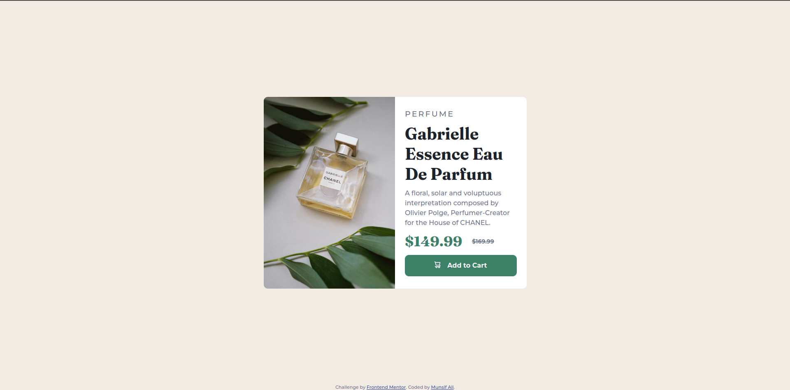
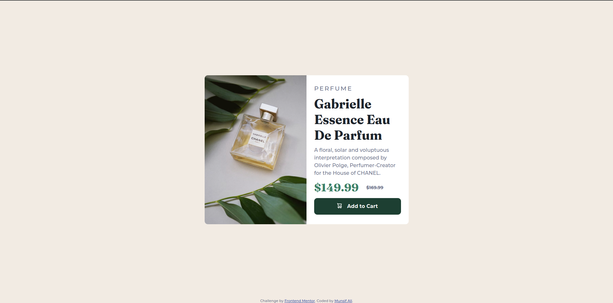

# Frontend Mentor - NFT preview card component solution

This is a solution to the [Product preview card component challenge on Frontend Mentor](https://www.frontendmentor.io/challenges/product-preview-card-component-GO7UmttRfa). Frontend Mentor challenges help you improve your coding skills by building realistic projects.

## Table of contents

- [Overview](#overview)
  - [The challenge](#the-challenge)
  - [Screenshot](#screenshot)
  - [Links](#links)
- [My process](#my-process)
  - [Built with](#built-with)
  - [What I learned](#what-i-learned)
  - [Continued development](#continued-development)
  - [Useful resources](#useful-resources)
- [Author](#author)
- [Acknowledgments](#acknowledgments)

**Note: Delete this note and update the table of contents based on what sections you keep.**

## Overview

### The challenge

Users should be able to:

- View the optimal layout depending on their device's screen size
- See hover states for interactive elements

### Screenshot

**Active State**

**Mobile Design**

### Links

- Solution URL: [Add solution URL here](https://github.com/Munsif-Ali/Frontend-Mentor-Product-preview-card-component-challenge)
- Live Site URL: [Add live site URL here](https://munsif-ali.github.io/Frontend-Mentor-Product-preview-card-component-challenge/)

## My process

### Built with

- Semantic HTML5 markup
- CSS custom properties
- Flexbox

### Continued development

I am also thinking to make this design in css grid also.On future projects I will try to use CSS Grid and also I will try to use more advance CSS properties.

### Useful resources

- [InternetingIsHard](https://www.internetingishard.com/) - This webiste has realy amazing toutorial for html and css. It had explained the topics such with simplicty it is very useful if you want to start with html and css.
- [Css Tricks](https://css-tricks.com/) - This is an amazing website for Css-Tricks. [Kevin Powell](https://twitter.com/KevinJPowell) The king of css has explained the CSS-Flexbox and Gridbox in very amazig and easy to learn way.

## Author

- 
- 
- 
- Frontend Mentor - [@Munsif-Ali](https://www.frontendmentor.io/profile/Munsif-Ali)
